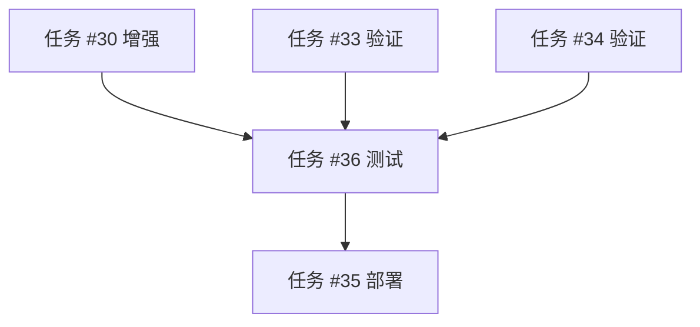

# 博客项目当前状态分析

> **分析日期**: 2024-04-06  
> **分析师**: pm

---

## 一、已完成组件清单

### ✅ 页面组件
1. **首页** (`src/app/page.tsx`)
   - Hero区域
   - 文章卡片展示

2. **关于页面** (`src/app/about/page.tsx`)
   - 个人介绍
   - 技能标签
   - 社交链接

3. **联系页面** (`src/app/contact/page.tsx`)
   - 联系表单
   - 联系信息展示

4. **文章列表页** (`src/app/posts/page.tsx`)
   - 搜索功能
   - 分类/标签过滤
   - 文章卡片网格

5. **文章详情页** (`src/app/posts/[id]/page.tsx`)
   - 文章内容渲染
   - 相关文章推荐
   - 分享按钮

### ✅ 布局组件
1. **导航栏** (`src/components/layout/Navbar.tsx`)
   - 毛玻璃风格
   - 响应式导航
   - 移动端汉堡菜单

2. **页脚** (`src/components/layout/Footer.tsx`)
   - 社交链接
   - 版权信息

### ✅ 核心视觉组件
1. **GlassCard** - 毛玻璃卡片
2. **FluidBackground** - 3D流体背景
3. **PostCard** - 文章卡片
4. **Button** - 玻璃按钮

---

## 二、任务状态对照表

| 任务ID | 任务名称 | 实际状态 | 预期状态 | 建议操作 |
|--------|----------|----------|----------|----------|
| #29 | 设计并实现博客导航栏组件 | ✅ 已完成 | 待认领 | 标记为完成 |
| #30 | 创建文章详情页（阅读进度条+目录） | 🟡 部分完成 | 待认领 | 补充进度条+目录 |
| #31 | 创建关于页面 | ✅ 已完成 | 待认领 | 标记为完成 |
| #32 | 添加页脚组件 | ✅ 已完成 | 待认领 | 标记为完成 |
| #33 | 优化平滑滚动和页面过渡动画 | 🟡 待验证 | 待认领 | 验证现有实现 |
| #34 | 增强 3D流体背景效果 | 🟡 待验证 | 待认领 | 验证现有实现 |
| #35 | 配置 Vercel 部署 | 📋 等待测试 |就绪 | 保持阻塞 |
| #36 | 端到端测试验证所有功能 | 📋 等待开发完成 |就绪 | 可以开始 |

---

## 三、剩余工作分析

### 3.1 任务 #30: 文章详情页增强

**当前实现**:
- ✅ 文章内容渲染
- ✅ 相关文章推荐
- ✅ 分享按钮
- ✅ 返回按钮

**缺失功能**:
- ❌ 阅读进度条（顶部）
- ❌ 文章目录（Desktop侧边栏）

**建议**:
1. 添加 `ReadingProgress` 组件
2. 添加 `TableOfContents` 组件
3. 集成到文章详情页

### 3.2 任务 #33: 平滑滚动和页面过渡动画

**需要验证**:
1. 页面滚动时元素的进入动画（已使用 `whileInView`）
2. 页面切换时的过渡动画（需要验证）
3. 平滑滚动行为（CSS `scroll-behavior: smooth`）

**建议**:
1. 检查全局 CSS 中的 `scroll-behavior` 设置
2. 验证 Framer Motion 的页面过渡
3. 优化动画性能

### 3.3 任务 #34: 增强 3D流体背景效果

**当前实现**:
- ✅ FluidBackground 组件存在

**可能需要的增强**:
1. 鼠标交互（粒子跟随）
2. 性能优化（移动端降级）
3. 视觉效果优化

**建议**:
1. 验证当前效果是否符合预期
2. 测试性能表现
3. 如需要则进行增强

### 3.4 任务 #36: 端到端测试

**可以开始测试**:
- 所有主要页面已完成
- 导航功能已完成
- 核心组件已完成

**测试范围**:
1. 页面渲染测试
2. 导航功能测试
3. 响应式布局测试
4. 性能测试

---

## 四、推荐的执行顺序

### 阶段1: 补充缺失功能
1. **任务 #30 增强**: 添加阅读进度条 + 文章目录
   - 估计时间: 1-2小时
   - 优先级: P1

### 阶段2: 验证并优化
2. **任务 #33**: 验证平滑滚动和页面过渡动画
   - 估计时间: 30分钟
   - 优先级: P1

3. **任务 #34**: 验证 3D流体背景效果
   - 估计时间: 30分钟
   - 优先级: P2

### 阶段3: 测试
4. **任务 #36**: 端到端测试验证所有功能
   - 估计时间: 1-2小时
   - 优先级: P0

### 阶段4: 部署
5. **任务 #35**: 配置 Vercel 部署
   - -估计时间: 30分钟
   - 优先级: P0（测试通过后）

---

## 五、依赖关系更新建议

### 建议的依赖关系调整:
- 移除 #35 对所有开发任务的依赖（大部分已完成）
- 添加 #36 对 #30 增强任务的依赖
- #33 和 #34 可以并行

---

## 六、下一步行动计划

### 立即行动:
1. ✅ 创建产品需求文档（PRODUCT_REQUIREMENTS.md）- **已完成**
2. 🔄 更新任务依赖关系
3. 📢 通知开发团队当前状态

### 短期行动（本次会话）:
1. 向 Lead 发送项目进度报告
2. 建议标记已完成的任务（#29, #31, #32）
3. 请求补充 #30 的缺失功能（阅读进度条+目录）

### 中期行动:
1. 等待开发完成剩余增强功能
2. 协调测试工作
3. 准备部署配置

---

## 七、关键决策点

### 决策1: 关于页面是否在 MVP 范围内？
- **状态**: 已完成
- **建议**: 接受并纳入 MVP，因为已经开发完成

### 决策2: 联系页面是否在 MVP 范围内？
- **状态**: 已完成（虽然包含表单）
- **建议**: 接受，作为展示即可（无需后端功能）

### 决策3: 搜索和过滤功能是否在 MVP 范围内？
- **状态**: 已完成
- **建议**: 接受，因为是纯前端过滤

---

## 八、风险评估

### 风险1: 任务定义与实际进度不一致
- **影响**: 中
- **概率**: 高
- **缓解**: 已通过本文档分析，建议更新任务状态

### 风险2: 剩余增强功能工作量超预期
- **影响**: 低
- **概率**: 低
- **缓解**: 功能相对独立，易于实现

### 风险3: 性能问题影响部署
- **影响**: 高
- **概率**: 中
- **缓解**: 在测试阶段重点验证性能

---

**文档版本**: v1.0  
**最后更新**: 2024-04-06  
**状态**: 分析完成，等待决策
